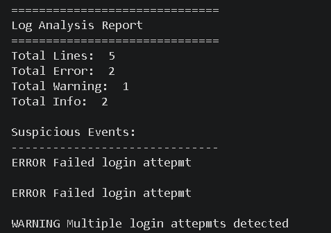

# 📋 Log Analyzer

A Python-based Log Analyzer that reads and analyzes log files to identify important events such as errors, warnings, and informational messages. This project demonstrates fundamental log monitoring techniques used by cybersecurity analysts and SOC teams.

---

## 📊 Project Overview


---

## 🎯 Features

- Reads log files automatically
- Counts total log entries
- Detects ERROR messages
- Detects WARNING messages
- Detects INFO messages
- Displays log analysis summary
- Beginner-friendly cybersecurity project
- Helps understand Security Monitoring concepts

---

## 🛠 Technologies Used

- Python
- File Handling
- String Processing
- Log Analysis
- Cybersecurity Fundamentals

---

## ⚙️ How It Works

1. The program reads a log file (`sample.log`).
2. Each log entry is analyzed.
3. The tool identifies:
   - ERROR events
   - WARNING events
   - INFO events
4. Counts are generated for each category.
5. A summary report is displayed.

---

## 🖥 Running the Program


---

## 🖥 Sample Output



---

## 📂 Project Structure

```text
Log-Analyzer/
│
├── log_analyzer.py
├── sample.log
├── README.md
│
└── screenshots/
    ├── log-analyzer-overview.png
    ├── Running Code.png
    └── Output.png
```

---

## 📚 Skills Learned

- Log Analysis
- Security Monitoring
- Python File Handling
- Event Classification
- Threat Detection Fundamentals
- SOC Analyst Concepts

---

## 🔍 Log Categories

### INFO
Normal system activities and informational messages.

### WARNING
Potential issues that may require attention.

### ERROR
Critical problems that indicate failures or security concerns.

---

## 💡 Real-World Applications

- Security Operations Center (SOC)
- Incident Detection
- System Monitoring
- Threat Hunting
- Security Auditing
- Troubleshooting

---

## 🌍 Why Log Analysis Matters

Logs provide valuable information about system activities. Security analysts use logs to:

- Detect suspicious activity
- Investigate incidents
- Monitor system health
- Identify attack attempts
- Support forensic investigations

---

## ⚠️ Disclaimer

This project was developed for educational and cybersecurity learning purposes only.

---

## 👨‍💻 Author

**Piyush Vishwakarma**

MCA (Cybersecurity) Student

Aspiring SOC Analyst | Digital Forensics Learner | Cybersecurity Enthusiast